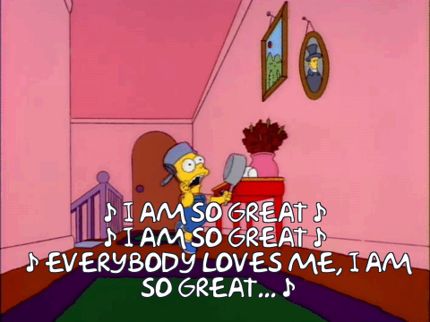

# 10/1/25 -
It had been quite some time since I journaled, but I am back and better than ever! I finished DPW, I started on git-it-together, and have been doing some creative coding for fun on the side to polish my skills. 

git-it-together is coming along nicely, I got the backend almost entirely done in Django, I also have authentication for users between front and beck so that's great. Now I just need to focus on getting the frontend together. 

Additionally, I have a personal website up now through gitHub pages:
	https://buicksalesman.github.io/


# 20/12/24 - 
Finding it very hard to progress and focus over the last two weeks. As you can see, I haven't really been doing much journaling, so after a freak day of depression yesterday, here I am pulling myself back up by my bootstraps. 

I have been banging my head against a wall trying to figure out the right order to start building this new app in. I originally set out with the goal of building it with no help from AI whatsoever. While in theory I could do this given enough time, I have realized I just don't have the time to do this properly if I want to meet my deadline of starting to apply for jobs by the end of the year. 

I have mulled over the philosophy of using/not using AI helpers to learn how to code in todays environment and job market for hours today, which has significantly detracted from getting actual work done. In the end, I will probably have to build this app the same way I built DPW, just using every resource I have to the fullest extent of my ability. I am convincing myself there is no shame in this. Years from now when I am further along in my programming career, I will look back and wonder why I was ever worried at all. I will hone the skills I need every step of the way, but until I get my first junior dev role, I need to learn as much as I can, and get as much done as I can in a short period of time, so that I can land that first role. 

I started today trying to make some React components that would send data to the backend to be sent to the database, but I have realized that until I have my views and urls set up properly in the backend, it is kind of a useless endeavor. Now I am focusing on making the backend logic I need to connect the frontend to. 

This has led me to the try/except block function in Python, which I am reading about here:
https://www.w3schools.com/python/python_try_except.asp

I need this to create a new user. I need to be able to check for unique usernames, and check if the POST request is being sent with a username and password at all. 

During the creation of this view, I took the time to install indent-rainbow, because Python relies so heavily on indents. This has helped me out a ton!

As of right now, I have the basics done for all urls and GET/POST/PATCH/DELETE methods in views. Feels good to actually get some stuff done, even if I did rely on AI to help me out along the way. 


# 13/12/24 -
Today is my 200th day of at least one commit to GitHub per day! I'm very happy with this accomplishment. To commemorate this, I shared DPW and it's demo video in the Actualize Alumni Slack, and received a lot of positive feedback!


# 12/12/24 -
I found out Django has a built in User model `from django.contrib.auth.models import User`  which comes with several built in methods, built in ForeignKeys, but most importantly, hashes passwords automatically. Saves some time for me!

Ran my first migration today, checked it out in Postico2.


# 11/12/24 - 
started work on git it together db models

created core folder in app 

reserached what models are in django 

https://docs.djangoproject.com/en/5.1/topics/db/models/


# 10/12/24 -
Met with Jeff to go over schema for git it together
got footage back from mr wolfe

# 04/12/24 - 
Oh my God I finally figured it out. 

After hours of testing different configurations for the power level calculations, I figured out that the power level for the css and the power level for the server calculations we two different things, running the same math in two separate places at once. Instead of type out everything that I did here, I'll just post the slew of messages I sent to Jeff as I was working on it.


Now I just have to work out the drawing when timer ends bug, and refactor some of the DC logic, and I can finally put this on the shelf!

Friday I will sit down and record the demo video. Very excited to move on to Git It Together. After I finish that, I think as a side passion project to keep my skills up while applying for jobs, I'll revisit my Desktop Pikmin desktop pet project.


# 03/12/24 - 
I played a game or two of DPW with career coach Ryan. During our first game, we encountered a bug that made the game break when he ended the drawing phase while he was still drawing. Collisions no longer worked after that, and one of my tanks disappeared randomly. Our second game worked flawlessly though. He had a ton of positive things to say about the game! He said it was actually so cool, and that with a few tweaks I could confidently ship to any recruiter. The main pieces of negative feedback he gave was that the text on the landing page is illegible against the busy, crusty desk background. He suggested making the letters looks lighter, as if they were freshly carved, or maybe using a different, less busy background. I'm going to try to enhance the effect of the carved letters, and make them a lot bigger, before I try his suggestion. He also added that I need a key to be visible at all times to designate what tanks, reactors, and turrets are. Lastly, he said the rules modal was way too wordy, and that I should add graphics and GIFs in place of explicit directions. Make players experience the game intuitively, instead of explaining everything in great detail, that no one will take the time to read. 

I also met with my developer friend Jon, and we played a couple games together. Jon and I discovered a huge bug, where for some reason if you only filled the power meter 60%-70%, it would result in a far longer shot than if you actually hit the reward zone. This was so confusing to me.

30 minutes later I met with Jeff, and we spent an hour debugging why this was happening. As it turns out, because the power level is calculated in milliseconds, the latency of sending data through the server was causing the power level to be calculated much higher than what is actually shown in the meter on the client. Here's how it works:
- On mouse down on the client, the client sends mouse down data to the server, which includes the start time of mouse down.
-  The server receives this data, and then starts a timer of it's own, which stops when the mouse up data is received. 
- On mouse up, the client sends the signal to the server that the mouse has been released
- The server receives that data, and calculates the force to be applied to a tank based on the time elapsed.
Here in lies the problem. The time it takes for the client to send the data to the server is not factored in. I need to move this start and stop time logic entirely to the client, and then calculate the power level on the server based on this time.

Maybe I can still find a way to validate on the server, maybe if someone sends an elapsed mouse down duration of above 650 milliseconds, they are always penalized. 

Jeff and I didn't get to work on Git It Together, but that's okay, we will next week.


# 02/12/24 - 
I posted DPW in the Blizzlet Discord channel, where it was well recieved, evident by 5 fire reaction emojis! However, no one actually tried to play the game. Maybe they will get around to it, maybe they won't. 

I started doing research on Django and SQL databases. I got Django installed and the basic file structure of the project set up. Being a year since I did any virtual environment work in the terminal, made the process very new and challenging. Excited to get better at this. I ended up going with PostgreSQL for the database. That's what we used in bootcamp, and Peter says it's industry standard. I got that set up as well, but there is no information in it. 


# 01/12/24 -
I created my new React app and GitHub repo for the new app. I am calling it Git It Together!


# 30/11/24 - 
So much has happened over the last 9 days, and I haven't kept up with this journal at all! Shame on me!
The final touches have gone onto DPW. Power meter increases have been moved to the client side, and the server validates the power level received by making sure it is and integer between 0-100, and also uses `Date.now()` to validate the appropriate amount of time a mouse is held down. 

I went through a ton of trial and error to improve the styling for both tablets and desktop. Overall, instead of just the game canvas being responsive to window size, the `gameAndPowerContainer` HTML element that essentially houses all game elements is now responsive to window size, and all HTML elements are sized relative to the canvas size. Added some additional styling and baddabing baddaboom ya got yaself a game. 

Additionally, I used some fancy logic to determine whether or not a user is playing on a tablet or desktop:

```
function isTabletDevice() {
const ua = navigator.userAgent.toLowerCase();

// iPad detection for iPadOS 13+
if (navigator.platform === "MacIntel" && navigator.maxTouchPoints > 1) {
return true;
}

// iPad detection for older versions
if (ua.includes("ipad")) {
return true;
}

// Android tablet detection
if (ua.includes("android") && !ua.includes("mobile")) {
return true;
}

// Other tablet detection
if (ua.includes("tablet") || ua.includes("kindle") || ua.includes("silk") || ua.includes("playbook")) {
return true;
}

return false;
}

if (isTabletDevice()) {
document.body.classList.add("tablet");
}
```

There are slightly different scaling factors, and slightly different css if the user is on a tablet. 

I am so excited for Mr. Wolfe's scholars to return from Thanksgiving Break so that I can get their feedback. 

I wrote a script for the demonstration video which will be recorded soon, and I will shoot this game onto my LinkedIn, as well as the Actualize Alum Slack, with the video. 

Jeff and I also met earlier this week, and discussed out next project. I need to dig out the Actualize has-many belongs-to spreadsheet to work out the ins and outs of my database, but I am excited to get it started. 

Here are some crude sketches of the beginnings of the project:


I plan to use React for the front end, Django for the backend (I want to become more experienced with Python), and SQL for the database. Jeff also suggested MongoDB for the database, but I think I will be more comfortable with SQL.

The basic idea is the GitHub commit calendar, but for any habit that you want to build or break. I have a lot of rough ideas floating around in my head, that I could write out here, but honestly this entry is so long that I will write out more of how the app will work when I have more concrete ideas in place. 

Excited to get started on the next thing, excited to upload the DPW demo video soon.


# 21/11/24 -
Met with career coach Ryan today, told him the story behind how the game came to be. He loved it, and we made a plan to make a demo video and create a sort of portfolio website moving forward. I have to write a script for the video to run by him, to keep it short, sweet, and straight to the point. 


# 20/11/24 - 
I've been gathering feedback from people I've shared the game with. Right now, Mr. Wolfe's school system is blocking onRender as a domain, so his students can't play it yet, but he is going to get them to allow it soon. 

For the most part, people find the game to be intuitive, I think I need better styling so that people are more inclined to read the rules. 

Ghost tanks can be a little confusing, and people don't let the color change on tanks when they are hit, as it's too close to red. I need to implement the smoke animation soon.

One of my coworkers who is not very tech savvy had a hard time controlling the game at all. Not sure what I could have done to help him, but he gave up after a few turns lol. 


# 19/11/24 - 
Digital Paper Warfare is deployed on Render!!! 

I feel a million times better about the project now that it is what it _IS_, rather than _WHAT IT'S GOING TO BE_.

While meeting with Jeff today, we took some time to address the disconnect bugs that have been crashing the server. We settled on a quick fix of just reloading the pages of both client to the landing page if either player disconnects, and then during the last 5 minutes of our session, we deployed and played a few games. I also played a few games after this with my girlfriend. She played on her iPad, I played on my laptop. She really enjoyed the game, and she doesn't even play video games! So that's a good sign. 

It's really convenient to have the auto-deploy feature from GitHub built in to the OnRender service. The free tier doesn't give me much RAM or CPU, this could pose a problem if I have more than one game going at once.

I let Mr. Wolfe know we can play the game now, though it is still a little buggy. We are planning to play a game tomorrow after his school day. 


# 18/11/24 - 
I talked with Peter today, the Dean of Instruction at Actualize. Every few months I like to hop on a call with him and just talk about whatever comes to mind, coding or otherwise. He has a lot of valuable insight that really hits home for me. I talked with him about the journey I've gone on while making this game, and how much I have learned. His response was "prove it". He goes on to say, that he obviously believes me, but no one can see that from a recruitment standpoint right now. I'm trapped in the zone of not deploying this project until it is "ready". "Facebook is never _finished_, Twitter is never _finished_", he says. We talked about once it's deployed making a 2-5 minute demonstration video of the game. It's always nice to talk with Peter. 

I'm planning on deploying the game, "ready" or not, tomorrow with Jeff. 

"This is a passion project between me and Mr. Wolfe, and Mr. Wolfe. doesn't know how to code."


# 16/11/24 -
I spent the last couple of days working on decreasing opacity for ink usage, to make it look like you are running out of ink on the page. I like the idea in practice, but I think when we create bodies from the shapes, we need to make the entire path fully opaque. I think I'll go ahead and do that and then start work on my big refactor.


What I ended up doing is on game state change into the battle phase, the shapes get retraced will full opacity. This provides a nice way to show that the player is running out of drawing pixels, but doesn't affect the overall aesthetic of the game board negatively. 

I haven't quite gotten to refactoring my code yet today, but I have spent hours combing through the code and making detailed comments breaking down what each variables does and where it is called. Soon I should be able to do the same with server events, and refactor as I go. What I've discovered is that my client code is 10x more susceptible than I thought to malicious manipulation. What I will end up doing on the long run is moving basically all data transformation code into the server, and make the ONLY job of the server to be to render received data and send mouse event data. Everything else will be processed and validated on the server. There are one or two things that I can't enforce or validate on the server side, which mainly have to do with browser events. I will have to download a tool to obfuscate code like disabling the context menu, to make it harder for malicious clients to interact with. 

# 12/11/24 -
timers
met with jeff code is really messy
finish timer and letz play button and then major cleaning and refactor is due


# 11/11/24 -
Like yesterday, I didn't have the time to do much coding today, so right before bed I added a coin flip on game state change from drawing to battle to determine which player starts first. This, weirdly, has introduced a bug where on game reset, the player that did not initiate the disconnection cannot draw shapes if the immediately rejoin a game without refreshing the page. I thought I handled this appropriately in my disconnection event by erasing the shape array for both players, but I guess I have to take another look at it.


# 10/11/24 -
I implemented taking turns quickly before bed today, can't break my commit streak!


# 09/11/24 - 
Today I took the rules modal that I fleshed out yesterday and added it to the landing page, so that a player has the option to read how the game works while they are not actively in combat. 

I also hooked up the erase drawing button to a function that deletes the last drawing a player made. This is functional until the 10th shape between both players is drawn and the game state transitions. To make this process simpler, I changed the protocol on how and when shapes are created. They are no longer created in the Matter world when the shape is snapped closed, but rather when all shapes are done, we iterate over every shape in the shapes array between both players, and turn them all into solid bodies when the drawing phase is over. 


# 08/11/24 - 
combined files today - made a bigger deal out of it than I should have 

I finally smashed together the drawing and moving/shooting files today into one big file that works together! I honestly make it scarier in my head than it actually was, I could have done it start to finish in less than an hour, but it took about 3 because of how nervous I was of blowing the whole thing up. Now that the files are combined, I can't believe how big this project has gotten! I suspect grand total I will have 4,000-5,000 lines of code when I finish. I would have been too scared to start this project had I know what I was getting myself into at the time, but now that I'm here I'm so happy where I am. 

When I surmised this to Jeff, he gave me the ancient programming proverb of
`We do this not because it is easy, but because we thought it would be easy`.

Here's what the game is looking like now, and if I do say so myself, it's pretty sweet!
![[Screenshot 2024-11-08 at 12.43.22 PM.png]]
The most challenging thing to handle was combining the mouse event handlers. In the end, I ended up making a new function with conditional statements in it, that basically says if it's x game state then to x mouse event, and if it's y game state then do y mouse event.

I also made a full list of rules, that I put into the rules modal. While I was doing this, I researched a lot of fonts that might be fun to use while styling everything. When everything is said and done, I would love to put my styling skills to the test and make everything look really impressive. 

Lastly, I tried to implement a sticky note that laid slightly over the game board that would server as a container for messages to the player emitted from the server. Things like 'you're not allowed to do this!', 'it's not your turn!', 'tank destroyed!'. In the end, I couldn't get it to look right with my css, and the flexbox was starting to melt my brain, so I deleted everything and will try again at a later date. I probably shouldn't have wasted time on it until the rest of the game was functional. 


# 07/11/24 - 

`Be not defeated by the rain, Nor let the wind prove your better.  
`Succumb not to the snows of winter. Nor be bested by the heat of summer.  
  
`Be strong in body. Unfettered by desire. Not enticed to anger. Cultivate a quiet joy.  
`Count yourself last in everything. Put others before you.  
`Watch well and listen closely. Hold the learned lessons dear.  
  
`A thatch-roof house, in a meadow, nestled in a pine grove's shade.  
  
`A handful of rice, some miso, and a few vegetables to suffice for the day.  
  
`If, to the East, a child lies sick: Go forth and nurse him to health.  
`If, to the West, an old lady stands exhausted: Go forth, and relieve her of burden.  
`If, to the South, a man lies dying: Go forth with words of courage to dispel his fear.  
`If, to the North, an argument or fight ensues:  
`Go forth and beg them stop such a waste of effort and of spirit.  
  
`In times of drought, shed tears of sympathy.  
`In summers cold, walk in concern and empathy.  
  
`Stand aloof of the unknowing masses:  
`Better dismissed as useless than flattered as a "Great Man".  
  
`This is my goal, the person I strive to become.
 `
I found this poem by late Japanese poet Kenji Miyazawa today. It has resonated deeply within myself. The themes of humility and a simple, happy life, parallel with the ebb and flow of the natural world, helping others along the way, is something I feel is missing from the greater modern day society (at least the societal bubble I find myself in!). I found several translations of the poem, but I think I like this one best, and is one of the better translations across the 4 or 5 of them that I read.

I read up on Kenji through his Wikipedia article, and I have to say I admire him a lot, although in the poem itself he states he would rather be useless to all than be considered a "Great Man".  He was a novelist, poet, wrote children's literature, as well as being an agricultural science teacher, cellist, devout Buddhist, and a utopian social activist. Being a writer, musician, scientist, (I forgot to mention) artist, paired with a social philosophy of humility and non-consumerism, is just about the most respectable type of person I can image. 

An anecdote I found interesting from his Wikipedia was that although he was learned in the natural sciences (as much as someone could be in the early 1900's), he ended up failing at producing better harvest for the farmers he admired so much. They often sneered and snickered at the idea of a "city slicker" teaching them how to properly farm. He advocated for the use of natural fertilizers, as opposed to the preferred western chemical fertilizers. Of course we now understand that over time altering the environment too drastically from it's natural state disrupts the delicate balance of the living web that is the surrounding ecosystem. While there is no such thing as an inherently "better" fertilizer, chemical or natural, I believe he had the right idea in mind to farm along side the natural pattern of the environment. Had he had the botanical knowledge we have today, maybe he would have been more successful in his techniques.  


### Back to DPW!
I have finally implemented the long await "tracks in the sand" that gives the pen and paper game a distinct look! It really helps drive home the pen and paper aesthetic of the digital version. In the digital game, the tracks gradually disappear with each movement a tank takes. In the paper version of the game, the whole battlefield would become scribbled over with movement tracks, which was always a gripe of mine! Here's a quick demo video!

```video not supported in md :(```

I realized today that the way I implemented force calculation in the new version of the game is slightly different from my single page application mock-up. In the mock up, a value was calculated based on the exact level from the incrementing power meter. In the new version of the game, it is based off of time held down by the mouse. This means that the longer you hold down the mouse, the further the tank goes, to infinity. So I implemented a power cap! The tank now automatically releases after 1.2 seconds. I played around with the client side code to match the incrementation of the power meter to this 1.2 second climb. 

Orange is definitely not the right color to distinguish damaged tanks, as it looks almost identical to red on a lot of monitors. Even though the tank tracks match the player color, I still don't like it. I am thinking of adding an animation of smoke billowing out of the tanks if they are damaged. This would play on loop until the tank is hit again, and destroyed. 


# 06/11/24 - 
Today I added wobble animations from my SPA prototype of DPW into the current project. I'm happy to have these back, and I changed the logic a bit so that the wobble starts when you hover over a tank, instead on clicking on a tank. It then releases when the tank performs and action, or if never clicked, when you are no longer hovering. 

I also added hit points to the tanks and reactors, and a brief conditional statement for win conditions, that reloads both clients if a win condition is met!

I can't believe it, but Mr. Wolfe told me he has always played the game with tanks having one hit point and not two! I have been misremembering this and playing the game incorrectly for the last 15 years! Funny how unreliable and mutable. I think I will keep the tanks with 2 hit points for now until I get feedback from play-testing. I feel like there is a better balance to the game with reactors at 1 hit point, and tanks at 2. 

Lastly, I added a color difference for tanks who have been hit. They change from the player color to orange when they have less than 2 hit points. this does however present a problem if all tanks have 1 hit point, how could you tell whose is whose?


# 05/11/24 - 
I made a new file to work on moving the tanks around in, got the basics up and running. I also added shooting using some of the same logic.

```video not supported in md :(```

I tried to validate a few things in the server with this logic, I was successful at validating time held down b eing equal to force in the server, but I wasn't able to validate disabling the context menu for mouse events in the server.

I met with Jeff today, and showed him my progress over the last week. He pointed out a lot of things that I should probably change on the client side, and make more secure when moving them over to the server side. The biggest one being game states. I have game state changes in both the server side and the client side. Meaning, once the server successfully changes states, it sends a message to the client saying "okay, now it's time for you to also change game states", and it changes the game state flag in the client to the next phase of the game. How this should really work is:
	Game states should only exist in the server, and if an event is ever sent to the server, the server should validate that the the game state is appropriate for that action. For example, a mouse event in the PRE_GAME (drawing) game state should result in drawing, and that same mouse event in GAME_RUNNING (battle), should result in a move or shoot action.

At this time I am hoping to start learning about deployment by the end of my big coding day on Friday, next week!


# 04/11/24 - 
At the time of writing this I have been coding for about 6 or 7 hours today and we have made a ton of progress!

I was chatting with Jeff about how I was approaching coding today and he graciously offered to huddle with me for about 10 minutes to plan out what I should work on for the day. I had originally intended to refactor almost all of my code before completing the drawing phase functionality today, and he astutely pointed out that if I spend a bunch of time refactoring, and then I end up changing that code later, it's basically just wasted time. 

It's very interesting (and a bit frustrating, but a sign of progress) to me that when i first started to take coding seriously, I was on the 15 minutes a day, and practice problems, and HackerRank problems, and I could sit down for 30 minutes to an hour and feel like I actually made progress. Now that I have this huge project going, it’s almost meaningless to spend anything less than 2-4 hours a day on it. It takes 30 minutes minimum to actually get myself acquainted with the problem I have to solve, or the code I want to add, before I even start adding it. This sucks because on a day when I only have an hour max to code, it makes it difficult to actually get a commit in on the project. I don’t want to spend this time doing practice problems and such, because I just want to make progress on my project. 

I started with fixing the mirroring and flipping sequence for drawn shapes after inserting the fortresses, other matter bodies, and no draw zones. 


The above images showcases how the drawings represented themselves before I fixed the error. The below video shows how it works after I fixed it!

```video not supported in md :(```

Does the above video seem off to you in any way, dear reader?


I immediately realized that while the drawings were accurately flipped and mirrored, THE CANVAS ITSELF (including all Matter bodies) WAS NOT. Only the colors of the Matter objects were inverted, based on player number. 

How could I be so stupid! All I could do was laugh at myself. I started to think that my underlaying architecture of the entire project was flawed, missing an absolutely key feature. I frantically messaged every dev I know, proud to let them know I had hit the milestone of making my first huge mistake that would have me untangling and refactoring my last three weeks of work. 

I paced around my apartment, talking out loud to myself about how to fix this issue. I quickly realized the only way to make this work, was to have a central game world on the server, and just rotate the whole canvas around it's center point for player 2's client. 

It took me about 20 minutes to fix, and I only had to edit about 10 lines of code.

After that, I went to work implementing boundary procedures for all of the various forms of illegal shapes. I removed the snap closed ink usage from the ink usage total (which only required deleting 2 lines of code, no other changes). I also disabled right clicks during shape drawing, and enforced this on the server by having any interruption of any drawing event result in an emittance of shape end and snap. 

Finally, after all this time! WE CAN MOVE ON TO CREATING MATTER BODIES OUT OF SHAPES. Thankfully, my old code for creating a small Matter.js circle body along every point int he drawing path, integrated seamlessly, and now, we have this:

```video not supported in md :(```
Now I think it's time to finally tackle movement systems. I just need to decide if I want to work out a few bugs with drawing first, or keep chugging along at the basic systems. I'll update this entry soon with what I decide. 


# 01/11/24 - 
I thought i finally implemented overlap protection on the server today in PDW, until I realized that shapes are being tracked on both sides of the board - so to speak.

Here is this effect illustrated:


I think right now that something along the lines of overlap checking before mirroring is happening, since shapes are validated on the server. I'm going to dig into this more and update this journal with what I find out!


# 30/10/24 - 
Didn't get to do a lot today, I have long week ahead of me with getting up early 6 days in a row to open the restaurant. It will be worth it though for the three days off in a row I have to code once I'm done. I'm quite tired after work today, so I imagine I will be quite tired every day this week, but I won't let that break my coding streak! All I really got done today was fix a bug that was causing shapes to be translated to the other side of the gameboard on canvas redrawing. I realized there was a typo in the code while trying to implement ink changing color during drawing.


# 29/10/24 - 
Met with Jeff today for over two hours to work on my project. Explaining how my code worked to him in real time, and having him continually ask questions about how things work, REALLY helped me understand my own code better. We debugged a lot of stuff, and now I feel like I really understand what is going on in my project at a greater level. I am excited to keep building, and feel out of the muck after this session. Jeff is a really good mentor. 


# 28/10/24 - 
After much trial and error on trying to implement shape overlap detection in my current code, I decided to go ahead and create a new mock server and mock client and cut out all the code that was getting in the way. I set out to create code that would detect if a line was over a certain pixel length, and then erase it from both clients if it was over that length, while maintaining all legal lines in the process. I now have this up and running which I am very happy about, and the code is a lot more secure from malicious clients, being very server focused. I intend to build off of this into full overlap detection over the next few days.

```video not supported in md :(```


# 27/10/24 - 
I spent a long time today combing through all of the different files I had created for various feature of DPW, and combining them into one file that functions correctly. At first I used the compare selected files feature built into VS Code, but it proved to be a little too messy, and I ended up creating a new file from scratch to compile all of my different features into. I did this both for client and server side. At the end of the day, we now have support for multiple game rooms, a Matter world running in each room, all of the Matter objects rendered on the canvas, the canvas flipped and mirrored in each game room, and the ability to draw five shapes in each room. Next I will be tackling shape intersections. This code was complicated in the single page application, and it proving to be even more complicated to validate across a server. I have tried three or four times now to make it work to no avail. 

```video not supported in md :(```


# 24/10/24 - 
Added passcode feature. Players can now enter an alphanumeric 6 digit passcode to be able to play with a friend if they share the room passcode with them. This has been my first real venture into regular expressions, which i used to validate that the passcode is alphanumeric, and exactly 6 digits long.


# 23/10/24 - 
Thought I'm embarrassed to admit it, I finally broke down and started really combing through the socket.io documentation. I should have done it long ago. After not being able to break any ground on DPW for a few days, and chatGPT being unable to help me create valuable code, I've decided it's time to actually learn about what I'm implementing. 

I've started learning a little bit about HTTP servers, and what the difference between that and a socket.io server is, and why I need both in my project. 

I want to make a passcode feature, that allows people to create a game room with a passcode, and have another person enter that passcode so they can play against their friends. Of course you will still be able to make a room with no passcode and get a random opponent. 

Coding has been coding very slowly this week. I'm not sure if it's ADHD flaring up, a desire to move on to a new project, or just that I'm now learning a whole new framework and tearing my beautiful project apart to integrate the new framework. Going backwards to go forwards can be frustrating, but I'm not letting it get me down. Soon I'll be just as productive with this as I was when I learned all about Matter and the canvas api. 


# 20/10/24 -
I opened up a new file for sever and client in D.P.W. today so that I could debug what the drawing functions are doing and start from scratch. Drawing and snapping and mirroring correctly now works in real time across the server. 

I have noticed that disconnecting and reconnecting is not working correctly. Once a player disconnects, their canvas refreshes and when they rejoin the room the drawings from the other players canvas are not displayed at all. I would like a 20 second - 1 minute window where you can disconnect and reconnect like nothing happened, where the game pauses, and upon reconnection, no data is lost and everything is rendered correctly. 

Additionally, I would like a total disconnect to result in the game room being completely erased, and the player still on the server to be sent back to the landing page in their own room. I may have to start from scratch with this. It is likely I will have to start from scratch on socket stuff, drawing stuff, and movement stuff, and wire it all together in unison with the game setup stuff that I have already made from scratch. 


# 18/10/24 - 
We have game rooms! It's a big coding day today, so I'll be updating the journal periodically as I make progress.

```video not supported in md :(```

My first day coding with socket.io was NOT fun, but I do have something to show for my work. 
I was able to set a html canvas based on screen size for each player, and have the bodies and dividing line and Matter world for each player relative to that screen size, which you can change on widow resize in real time. It even works across multiple game rooms and different devices! I broke out the iOS Simulator for this one. Gravity is turned on in the video for demonstration purposes, with opposing x,y values.

```video not supported in md :(```


# 16/10/24 - 
I got a prototype of a server up and running in a mock project! I had to initialize the Matter world on the server side, as having two clients with their own engines, renderers, and runners, pretty quickly led to asynchronous behavior among da ballz. After fixing that, we are left with this:

```video not supported in md :(```

Jeff suggested making a file that denoted everything that actually happens in a game, so I can pick apart what needs to happen on the server, and what needs to happen on the client. So I guess that's what I'll do next, and hopefully start really digging into the code on Friday, when I'm off work.


# 15/10/24 - 
I have n't updated this journal in a few days, but to catch up:

A few days ago I spent a long time refactoring and cleaning every little bit of code in Paper Warfare. It's still not perfectly clean, whatever that could mean, but it's nice and organized, and has lots of helper functions now. We are up to 1600+ lines of code!

The day after that, I didn't have a lot of time to code, so I asked chatGPT to write me up 10 JavaScript practice problems, and tried my best to solve them. I solved 80% of them with no help, including FizzBuzz, which was my first time ever attempting the notorious problem. 

Today, I started work on implementing socket.io. It's definitely a chore, and I tried making two mock projects just to see if I could get basic syntax down. Tomorrow I think I will make a new repository for Paper Warfare, and start with socket and node server setup, and then try to create a Matter.js environment, and then try to manipulate things within that environment. It will be interesting to see if I can get things to render in real time, or close to real time, between two windows. 

Updates to come soon!


# 11/10/24 - 
Crossed off everything on my list today! We are ready to implement socket.io and reach MVP!
There is now a turn timer, and a draw phase with a drawing timer. There is a rulez button with a modal that pops up describing the game rules. There are rewards and punishments for reaching certain zones on the power meter. I added a cool font that makes all the text in the game look like it's scratched into the desk surface. I added a coinflip to determine which player goes first. I fleshed out the win conditions so that the game ends and can be reset if both of a players tanks, or one of their reactors are destroyed. I added constraints to takes so they cannot be pushed when they are at rest. I adjusted the size of the shape walls to make clipping harder to achieve. I added collision events between shells and shape walls that remove the shell from the game world, so you can't clip your shell through shapes while shooting.

I cannot wait to show Jeff and start implement socket.io. I am debating whether or not to go ahead and refactor everything I just did now, or wait until we have socket in place. 

In honor of all of this, here is a video of the full game in action:

```video not supported in md :(```


# 10/10/24 - 
I added a wobble animation to the tanks so that you can tell if you're clicking on one or not! This makes me happy. 
```video not supported in md :(```

I also implemented a no draw zone around the fortress, and player turns in the pre game phase for drawing, so player 1 can draw 5 shapes below the dividing line, and player 2 can draw shapes above the dividing line. ![[Screen Recording 2024-10-10 at 6.03.00 PM.mov]]
I also changed the max ink per shape limit to be based on the window size, so that smaller screens don't have an obscene amount of ink. 


# 09/10/24 - 
Learned the difference between the bitwise or operator `|` and the logical or operator `||`. 
Updated all of the collision filters on all of my Matter bodies in Digital Paper Warfare (decidedly the new name of Tank Game), so that they interact with each other properly. I do still, however, have to add the collision filter to the drawn shapes so they interact properly with shooting and moving. I only have 18 small things left on my list before the game hits MVP!

So exciting to really cross the finish line on a project. 


# 08/10/24 - 
Met with Jeff tonight and updated him on tank game! We didn't code much, but talked through the rest of the steps I need to take until we are ready to implement socket.io. I have a list of a little over 20 things, that aren't too complex, before we reach MVP, I can implement socket.io, and host it on my website!


# 06/10/24 -
I have realized that a player can easily just not move any of their tanks, and position them by the fortress so that once the other player tries to make it through to the reactor area, they have 2 turrets and two tanks to tank out a single enemy tank advancing. To fix this, I may need to limit the amount of shots that turrets have, to make it just a bit more fair. 

I've implement hit points for tanks, as well as changing the color of a tank once it is hit, so you can keep track of hit points. I think this is a more elegant solution than having a hit point meter at the top of the screen. I've also implemented code, so that when one of your reactors is destroyed, the you get an alert that says "You won or lost!", and then when that alert is dismissed, I call `location.reload()` to restart the game. Eventually this will bring you back to a tutorial modal, that you can dismiss if you don't want to read the rules again. 

I need to also implement a turn timer, both for moving and shooting, as well as drawing. 

I also implemented prevention of overlapping shapes today. I did this by changing how shapes are created. Instead of turning all of the points of the outline into Matter bodies right away, I keep them on the drawing canvas, and if an overlap is detected during shape drawing, I clear the shape, redraw the legal shapes, alert the player that shapes can't overlap, and prevent the shape counter from being incremented. Once all shapes are drawn and legal, then all shapes are turned into bodies on the physics canvas. 

If we are including every file, and all comments, I have broken 1000 lines of code in this project. This is crazy to me! Tomorrow I will be adding a ton of comments so that I can better read and understand my own code when I come back to it. It's getting a little messy again.


# 05/10/24 - 
I have started work on adding the margins that prevent drawing on the tanks, fortress, or within a 5% margin of the edges of the canvas. For some reason, if the drawn line touches the edge of the canvas, the webpage crashes when it tries to snap the line closed. Maybe it's crashing because it's trying to create a matter body outside of the margin? Still figuring it out. It's also very confusing that it crashes when the line is drawn on the margin, but not the canvas boundary. 

After a few conversations with chatGPT, it looks like this is due to floating point errors, which I could probably fix if I updated my `getLinePoints()` function. I think the more elegant solution is to make something akin to matter shapes that prevent drawing, or just add 5% height and with to the game canvas when the game state changes from drawing phase to battle phase. I guess that wouldn't affect the dividing line or the fortress area though, so I've talked myself out of it while typing this. 

A few weeks ago my girlfriend brought home two rubber ducks that she got at work, that now sit on my desk so I can do rubber duck programming. I'm going to take notes here as I'm explaining the problems I have with the drawing system to the rubber duck
		- There is nothing to prevent a player from drawing a huge shape that takes up the whole map
			- This could be fixed with giving a player a set amount of ink, or a set amount of ink for each shape
		- If I give the player a supply of ink to draw with, they can still draw one huge shape just no other shapes, or they could just draw a bunch of tiny shapes 
			- This could big fixed by keeping the shape limit.
		- There is nothing stopping a player from drawing two massive shapes that creates a Battle of Thermopylae situation.
			- This could be fixed by having a maximum shape size, by giving a set supply of ink per shape. 

I have decided to implement both a maximum number of shapes at 5, and a maximum amount of ink per shape. I've got the code sketched out for it, but it needs some refining to feel right. Additionally, snapping the shape closed currently doesn't account for ink usage, so you can just draw a long line across the board, and have it snap closed as a shape. I think an elegant solution to this may be to give the players more ink the further away from the fortress they are, resulting in small shapes near the back of the battlefield, and larger shapes up front. 


# 04/10/24 -
Got up early and combined all the separate script files for the drawing and a movement that I've been working on, so now the bones are all together!
```video not supported in md :(```

Shape drawing is still janky, the most annoying bug is that they are offset sometimes from where you draw them, which you can see in the video above. Sometimes they also don't render if you draw something Matter doesn't like, and every so often they fly up to the top left corner of the screen. Still not super sure how this works. 

I've figured out that the offset is caused by having the shape broken down into less complex polygons, each with their own centroid. Each centroid is (I guess) averaged together to create the centroid of the body, which can offset it from the HTML canvas centroid. It works perfectly with simple shapes. 

```video not supported in md :(```
At this point I'm VERY tempted to just save each point in the drawing path, and make a small circle 

HELL YES IT WORKED I AM THE BEST 
I replaced bodies made from vertices with bodies made OF vertices. Now I make a small circle body on every point in the line, (using Bresenham's line algorithm). Now the drawing works perfectly. 

I need to next update my collision events so that any collision of a body with the drawn shapes makes the moving body static, thus preventing clipping of shells through shapes.

As a reward for my genius, I added explosions:
```video not supported in md :(```


# 03/10/24 - 
Started work on the fortress object today and offset the tanks to the left of each players respective board side to make the game have a little more area. Printed out the PDF Mr. Wolfe sent me of the game board and did a bunch of measuring and geometry to figure out the right positioning for the fortress. I hated it.

I also learned about mask in Matter.js, which allows you to group bodies together so that if they have the same mask value, they can collide or not. 

Learned about `requestAnimationFrame()`. It's cool that JavaScript has a built in method for animation. It's definitely proved useful in Tank Game. 

Finished fortress and turrets, which can shoot. I also normalized shooting and moving relative to screens size for tanks and shells, so they're finally not flying across the screen if the window is small. 


# 01/10/24 - 
Met with Jeff today for our weekly coding meeting, he helped me implement basic collision detection. Over the next week I'll be implementing collisions, win conditions, a tutorial modal, and in general get my game moved towards it's MVP. More developments in the coming days.

I'm not going to be able to put everything I want into tank game right away, and with all the ideas I have, I may have to remake the game in Unity once my other projects are done. This seems like a bit of a hassle, but in all reality I'm just excited to learn C based languages. 


# 29/09/24 -
I made a bunch of extra script files, and an extra HTML and CSS file in tank game to do a bunch of drawing testing. Instead of using vertices pixel by pixel next to each other, I changed the code to draw line segments, but have the line segment refresh every 10 milliseconds. this makes it a lot easier for Matter to process it into a solid body. Additionally, in the HTML and CSS we now have 2 canvases, one for drawing and one for physics, overlayed on top of each other, and the background image is now in the container. This really helps separate things out so that I can both draw and have shapes. 

No matter what I've tried so far I can't get the drawn shapes to bodies quite right. Maybe I will try filling in the drawn shape with tons of interconnected very small bodies next.


# 28/09/24 - 
I installed the poly-decomp library as suggested by the console message Matter.js gave me. It's... strange so far. It apparently is very bad at handling complex polygons, like if I were to draw a bunch of squiggly lines, it seems to do alright 75% of the time with it, but may crash 80% of the time, even if it handle the shape correctly. I'm thinking of if there is a way to delete all intersecting lines before have poly-decomp help matter make the shape. More to come soon. 

I'm going to try to debounce the draw function to see if it works any better - I tried it, it didn't do anything. I put the code I had in the afterRender handler into a function, and then called that function in the handler. Poly-decomp performs much much better this way, but you can't debounce something that is being called every game frame in the first place. 

I set the a property in my `Bodies.fromVertices()` option to always use decomp instead of quickDecomp by giving it the property of `ignoreBoundaryLimit: true,`. 

I need to figure out how to either make shapes with intersecting lines, clear intersecting lines from the inside of the shape and use only the outer boundaries of the shape before passing it to `Bodies.fromVertices()`, or just give an error message that say "shape can't have intersecting lines, idiot", and have that drawing not increment the shape counter. 

Shapes are looking pretty complex!


ChatGPT suggested that it might be feasible to find the convex hull of a shape, and remove all of the intersecting lines within the boundary of that hull before passing it to decomp, using something called  Graham’s scan or Andrew’s monotone chain.

I am considering adding an option for a player to use their turn to spawn a power-up on a random place on their side of the map. Both players can get the power up depending on which players tank collides with the power up first. I'm considering things like double movement, multi-shot, and double turns. This game mode will be an easter egg called "crazy aardvark" mode, which initializes if you click the aardvark icon.


# 27/09/24 - 
Hurricane Helene stayed away from my part of town, so all we got was some heavy rain! Phew!

I coded from 8:30am to 6:00pm today, with a break for lunch and a nap. I completely restructured tank game, added regions for everything, added 200+ lines of code, and made more progress than I ever have before. I added so many things that it's hard to talk about here. 

We are up to 550 lines of code in the main script file!! This is unbelievable to me that I have that many lines of code that are all working together. I know there are codebases in the millions of lines out there, but I'm still so proud of myself. 

We now have reactor objects, and shell objects to be fired from tanks. The reactors and tanks are relative to the canvas size, which is relative to the window size, so nothing every looks wonky. Their starting positions are now relative to the window dimensions as well. Additionally, we now have player ID's, and each reactor, tank, and shell, belongs to a player. The shells disappear after they are shot. We also have a dividing line for the players now!

I couldn't implement collision logic today, that's still on the to-do list. Tried and failed. 

I fixed some of the drawing logic. It seems that I can draw points and push them into an array. The `Bodies.fromVertices()` Matter method seems to connect all the vertices of my line, find a center point, and then connect all of the furthest points of the line from that center point. In the examples below, I had the center point of the body set to populate at the center of the map, but as you will soon see, I made that a little bit cleaner by the end of the day. 


Every time I generated a body from a drawing, I would get this message in the console. 

I think that will fix the problems with how the shapes are fleshed out. Worth a shot, anyway. So I will look into that soon. 

I also completely refactored my entire codebase today and IT'S SO CLEAN NOW I LOVE IT.

(okay I rounded up a little on the lines of code)

I have distinct regions for all of my bits of code, and regions within those regions to keep things organized for me. It's soooooo much easier to navigate now. 

Here's a small demonstration video of the whole thing put together and working! I can't wait to make more progress on this!

```video not supported in md :(```

I also game across a new JavaScript built in: .find(), which is like filter(), but only returns the first value it finds in a dataset that matches a certain condition.

It is really amazing how much project building moves you forward in your programming knowledge. Not only do I feel like I can actually dig into a codebase a little bit now, but I have learned so much more about JavaScript building this silly game than I ever did with running practice problems or doing HackerRank puzzles. My next project with definitely have a Python backend, so that I can really get some good learning under my belt with that language as well.

This journal is getting pretty lengthy, I should also start thinking about making a personal website to publish it. I could just do it on GitHub, but I really don't like that idea for some reason. I'd like to have my own website where I could publish my next two projects as well as this journal on. I guess my third portfolio project will be to make a blog application to publish on that site. 


# 26/09/24 -
Had a mega coding session with Jeff tonight, two and a half hours! We really dug into tank game and tore it apart. He showed me how to implement breakpoints in Chrome DevTools. He also showed me how to introduce enumerators, which we are now using for game states. The app isn't working right now, but we added a ton of code, and tomorrow I will be piecing it all back together and get it working again. 

As a side note, Hurricane Helene is plowing through Atlanta right now. I'm excited to sleep through the storm, and we are all hunkered down with lots of supplies in case we lose power or water. I don't think it will be too bad for us though. It will keep raining for a couple of days, which I'm pretty excited about.


# 25/09/24 -
I probably won't be doing that much coding today, but I've reached a critical point in Tank Game, where I have to tear a few things apart and smash them back together. 


I've starting reading The Non-Designer's Design Book, by Robin Williams. It's a quick read about C.R.A.P design (Contrast, Repetition, Alignment, and Proximity), and it's been very informative so far. I've made it through the first unit on proximity, and I really enjoy how she gives many examples on how to train your eye on the four principles, over and over again. Additionally, I've started my delve into Plant Systematic by Michael G. Simpson, a book on land plant systematics, as well as general evolution and biology. It is incredibly information dense, and I am so excited to really get my hands on some real botany material. 

I've come up with a new project idea for after I finish Tank Game. It will be some sort of habit tracking website/app. Inspired by the GitHub commit chart, I want a user to assign a habit they want to build or break, and they can create a commit chart that automatically updates for every day that goes by where they do or don't do their habit. I also want climbing stopwatches, 'Days Since Last Incident' style. More to come on this as I flesh out the idea.

# 19/09/24 -
Just updating to say I'm on vacation in San Jose del Cabo, BCS, MX. I've been working on the game daily in small spurts, but really I've just been enjoying my time by the beach. I haven't missed a day of coding still, and plan to keep that up, but I probably won't update this journal until I get back on the 25th.

So far on my vacation, I've added directional input of movement, moved the buttons to the side of the game board and made the game board bigger, and made the size of the tank relative to the size of the game board, instead of fixed pixels. 

I'm also finally finished reading Charles Petzold's CODE, after which I have a book on Python to read, and Plant Systematics by Michael G. Simpson, which I will probably read first, as it's been on my reading list for a good long while. CODE was an incredible book, I highly recommend it to anyone interested in how computers work. It's really about so much more than how computers work, but you'll have to read it to find out what I mean by that. 


# 12/09/24 - 
I now realize that `Events.on(lorem ipsum)` does not mean "turn events on for this event", but rather "on this event". Makes so much more sense to me now. 

I didn't work on tank game yesterday, so today I had lost a little inertia on the project. It took a few hours of avoiding it, but I finally sat down and wrote some code. I have written code to increase the power meter and apply force to the tank if the mouse press is within the boundaries of the tank. I also utilized `Math.min()` to be able to increment the power level in whatever increment I see fit (still tweaking for good feeling), but still have the maximum power level not exceed 100. It was affecting the css, and pushing the red bar outside of the outline of the power meter. Here's a quick video showcasing what I've done:
```video not supported in md :(```
I guess now I am moving on to applying friction to the tank and ground, because I hate how slidey it is, and then we are moving on to integrating shapes and player turns, and then finally two player connection via socket.io! Very excited!

As a side note, here's a cool site I learned about today: https://www.shopyourtv.com/. A site that allows you to pick a character and scene from your favorite tv show, and find the items of clothing they wore as an outfit online!

UPDATE: I just figure out how to get the friction I've been looking for. It's not friction at all! It's the air resistance property, known as frictionAir in Matter.js. I will post videos in the days to come showcasing how much better it feels.


# 10/09/24 - 
Added a sweet background image to tank game to make it look like a piece of paper on a scrawled and scratched desk! I love it. It makes me so happy. 

Played around with a few mouse events in Matter.js, they seem pretty straightforward, so I am moving on for now to building the disappearing power meter. So far the power meter research has taught me about:
	JavaScript:
		setInterval() - A built in method that returns and interval in milliseconds. Returns an ID of a function of code snippet that you want to repeat. It repeatedly calls a function of executes a code snippet, with a fixed delay between each call. 
		``` setInterval(code, delay) ```
		clearInterval() - A built in method often used in tandem with setInterval(), that allows you to cancel the repeated action based on it's ID returned by setInterval()
		 `clearInterval(intervalID)

I have decided to take a page out of Hearthstone's book and make aesthetic and interactable doo-dads on the sides of the canvas. Going to make separate notes on what some good ideas for doo-dads are.

Met with Jeff today, and showed him the progress on tank game. We had a ton of fun exploring it. Modified an import statement to work a little clearer, and bounced ideas around on how the power meter should work. The way I have it set up is not very efficient, and I found out Matter.js can render bodies and objects straight into DOM elements, instead of only on a canvas. Can't wait to work on this tomorrow! 


# 09/09/24 -
Rebuilt tank game from the ground up with no help from any gpt. Wanted to fully understand the code I am writing. So far, I have gained new insights into:
	CSS:
		Overflow - I now understand that overflow is used to clip out content if it goes further than the boundary of the element it is contained within.
		Class names VS id names - I have gained insight into that class names are typically hyphenated as outlined by the BEM, and id names have to be unique, so they are typically styled in camel case.
		# symbol - Used for ID selectors.
		Type selectors - When there's no symbol, it's a type selector, which selects all elements for a specific type of tag.
		Class selectors - Starts with ".", which will select elements with a specific class attribute.
	Matter.js:
		Bodies - learned that the first two arguments into a Matter.js body (x,y), is the center point of where the shape will be created.
		mouseConstraint - Provides the ability for a mouse input to interact with the physics world. Included in this is the stiffness, constraint, which allows an object to be dragged around by the mouse. A high stiffness (1), makes it so that the body will adhere to the mouse absolutely. A low stiffness(.02) makes it so that the body lags behind the mouse movement. You can turn render: {visibility: ___ } to true, to see the guiding lines that symbolize the lag. No stiffness (0) makes it so that the mouse cannot drag the body at all.

I has a realization that I will have to have the two players screens on their respective monitors the same orientation, i.e. they both draw their starting shapes on the bottom of the map, and move upwards to try and beat their opponent. It just feels better that way, but I have no idea how to go about it yet.

Here is a small video of how the game looks now, rebuilt from scratch:
```video not supported in md :(```
This mouse listener has a very low stiffness, and you can see the guiding lines connecting the cursor and the tank body.

A challenge I encountered today was making the background of the Matter.js canvas transparent, I eventually figured out I just needed to set the background variable to null, which is the same thing I did with the tank, and then added the outline.


# 06/09/24 -
I have been largely unsuccessful in my first two hours trying to figure out how Matter.js works. I asked ChatGPT to help me, but it's been less than helpful. I have found a few introduction videos that I am going to watch to see if I can even get the libraries installed successfully. 

I spent six hours today working on Paper Warfare. Almost all of that time was spent trying to get the Matter.js library running locally, and watching some introductory videos on the library. I hope to really dive into this project starting Monday, now that I have everything set up.

In the Coding Train videos I watched, he used p5.js as a renderer instead of the built in Matter.js renderer. Something to consider for later, but definitely not something I want to look into right now. I really want to get the movement of the tanks settled first. 

For a bit, it felt like I spent a ton of time getting almost nothing done, but at the end of the day, I have an object, solid borders on the canvas, and the ability to move the object around as I please with the arrow keys of the keyboard. That's progress!

```video not supported in md :(```


# 05/09/24 - 
Finished day 30 of the javascript30 challenge! Coded the script for a whack a mole clone. I definitely learned a lot from the javascript challenge. I think the best thing to come out of it was it introduced me to a lot of built in methods that I don't normally get to use during my standard practice with arrays, variables, hashes, and classes. I'm trying to stay out of tutorial hell, but it does occur to me that when you go and get a computer science degree, they don't just lock you in a room and say "BUILD STUFF". There is definitely a happy middle ground. 

It was Kelsey's birthday today :). I got her a nice card, and made her a triple seared fillet minion with a red wine jus, luxuriously creamy mashed potatoes, and boiled artichokes to be dipped in butter. For dessert I made a homemade strawberry shortcake with homemade whipped cream.

As on now I have no tutorials calling my attention. I may check out Wes Bos' what-the-flexbox course, but for now all I want to do is build my game.


# 04/09/24 - 
Today marks 100 consecutive days of programming! I KNOW I am a much better programmer than I was 100 days ago, and it feels great! I hope to continue for a full year going forward.![[Screenshot 2024-09-04 at 5.20.27 PM.png]]

Finished day 29 of the javascript30 challenge. Learned about timestamps, and made a timer application.

I don't think I will be able to work on tank game today, not enough time in the day, but I did say I would describe the features of how the game is built, so:
		I have finally decided how the shooting will work:
		![[Screenshot 2024-09-03 at 5.47.44 PM.png]]
		![[Screenshot 2024-09-03 at 5.50.50 PM.png]]
		![[Screenshot 2024-09-03 at 6.00.36 PM.png]]
		![[Screenshot 2024-09-04 at 5.59.14 PM 1.png]]
		I have to define a maximum and minimum shot as well. 

UPDATE: My girlfriend is dying her hair tonight so I have some extra time. It looks totally possible at a first glance to seamlessly integrate matter.js with the HTML5 canvas api. Very excited to see this come together. 


# 03/09/24 -
Finished day 28 of the javascript30 challenge. Made a slider that controls playback speed of a video from 0.4x playback speed to 4x playback speed. Quick lesson, only reinforced topics from other videos like queryselectors, and recording exactly where your mouse is relative to a div or other element. 

I listened to a freeCodeCamp podcast this week where they interviewed Emma Bostian, a project manager at Spotify, and coding content creator. During the interview she touched on mentorship. I meet once weekly with my mentor Jeff. She talked about how if someone is taking the time to mentor you on your coding journey, it is the mentee's responsibility to make progress, and have a game plan going into each session, and the mentor's responsibility to provide feedback, and ideas for what the mentee can work on and explore until the next session comes. I took that to heart, and now I am going to prepare exactly what Jeff and I will work on each session. I did that this week, and I felt that Jeff and I had the most productive session we have ever had. 

Worked on tank game for about 2 hours before my meeting with Jeff. I got to explain all the systems I have worked out on how to make the game FEEL fun to Jeff, we made a ton of progress. I have decided to use matter.js as a library for the tank game (new name coming soon, something like Paper Warfare) project. The canvas api is great, but not being able to interact with the "tanks" or "reactors" on the canvas' bitmap is a real drag. Trying to manipulate pizel data with vanilla js has proven to be quite the challenge.

Tomorrow I hope to do my javascript challenge, and then spend time exploring and building with matter.js. In tomorrow's entry, I will write about the different features of the game, and how I want the systems to come together as a fun product. 


# 02/09/24 - 
Finished day 27 of the javascript30 challenge. Learned how to do click and drag on multiple divs with pure js.  Starting to get the hang of return in functions when I have an activator NOT active. 

It's been a busy, busy week. Too much real life getting in the way of my coding progress. I hope to resume this journal this week. I'm about to turn a corner and start doing entirely project building going forward. NO MORE TUTORIALS. The javascript challenge has for sure been helpful, but I'm ready to start learning about what I want to learn about, along with what will help me be a better web dev. The real learning will come from failure after failure, and I need to get accustomed to that. I haven't missed a day of practice though, I'm coming up on 100 days in a row!


# 25/08/24 - 
Deliberate practice today was nested loops in python, I focused on using list concentration. List concentration is so fun, and so elegant. It just makes sense to me. Here's an example of a problem that I just loved:
```
# Use nested loops with an array of numbers to compute a new array containing the first two numbers (from the original array) that add up to the number 10. If there are no two numbers that add up to 10, return false.

# For example, [2, 5, 3, 1, 0, 7, 11] becomes [3, 7].

numbers = [2, 5, 3, 1, 0, 7, 11, 9]

pairs = [
(numbers[i], numbers[j])
for i in range(len(numbers))
for j in range(i + 1, len(numbers))
if numbers[i] + numbers[j] == 10
]

first_pair_that_returns_ten = list(pairs[0]) if pairs else False
print(first_pair_that_returns_ten)
```
The variable names could use some work lol. I can't wait to practice more code like this and get better at better at manipulating data. 

Finished day 24 of the javascript30 challenge. Learned about bubbling, propagation, and event listeners. Very helpful lesson. I like these tutorials where you don't do too much coding, but you actually get to sink your teeth into what is actually happening between the code and the browser in js. 


# 23/08/24 -
Finished day 24 of the javascript30 challenge. I'm well over the schedule of doing 1 a day at this point, but that's okay. I've really enjoyed the educational web-design elements of these lessons, as well as the practice of methods and styling they give. I think I may do the flexbox course the creator has to offer when I am done, but after the 30 day challenge, I think I will be focusing almost entirely on projects and open source, aside from my daily deliberate practice. 


# 22/08/24 -
Finished day 23 of the javascript30 challenge. Interacted with the SpeechSynthesisUtterance API. Had a lot of fun making it say random things. 

Got the second draft of tank game up and running. Shapes now fill in correctly, the canvas is static so it is unaffected by zoom, and I have a few placeholder buttons laid out for if I want to reset the drawing or concede the game. I am trying to figure out how to really determine what is the right amount of shapes to let the player draw, after all, if you just draw one big shape, what happens if there is not enough room to draw more?

![[Screenshot 2024-08-22 at 9.04.59 PM 1.png]]

I'm thinking of solving this by giving the player a set amount of "ink" to work with, but I am hesitant because five shapes is how I have always played the game!

# 21/08/24 -
Finished day 22 of the javacript30 challenge. Built a css bubble that follows links around the page as you hover them. 

Spoke with my old Actualize instructor, Peter, for about an hour and a half. I really like talking to Peter. We seem to philosophically see eye to eye, and I felt like I didn't get enough time to speak with him one on one during bootcamp. We talked about a variety of topics, but he gave me some good advice on job searching and programming at the end of our conversation. I am going to keep building my portfolio up, and this coming week I am going to get the iNaturalist app running on my local machine. It will be hard, but I am excited to start contributing to the repo. 


# 20/08/24 - 
Worked on Tank Game with my mentor Jeff tonight.

Jeff helped me learn and understand a little bit more about the canvas fill methods I was looking into during my last entry. 

We've discovered several things that I need to re-code. I'll be starting on a second draft of the game tomorrow, building from the ground up while keeping some of my good code. 

Here's a list of things that I did "incorrectly":
	-Stored starting and ending points of the lines I was drawing in variables, rather than an array
	-Called my fill function only at the end of every mouse move, so only the very last mouse move event would fill from the starting point of the entire line, to just the starting and ending points of line of the last mouse move
	-Was resetting the counter on every resize of the canvas, making the shapes disappear, but not resetting the shape counter
	-When using ChatGPT to help build the basic functions, I had it reference HTML canvas code that I used in one of the javascript30 challenges. This source code was coded at a pretty beginner level, and inefficiently, leading ChatGPT into some messy and unnecessary constraints while building it's own code. 

There are some more things that I have to fix, but those are the big ones I will be tackling in the second draft.

I also need to decide whether or not to overlap shapes. After all, isn't two overlapping shapes just one shape?

Lastly, I need to find a way to prevent drawing within a certain distance of the tanks and reactors, and implement a check to make sure there is at least one viable pathway for the tanks to move to the other side. 


# 18/08/24 - 
Finished day 21 of the javascript30 challenge. This day involved working with geolocation on iOS. I installed Xcode, and and got to play around with the Apple Watch and iOS simulators. Very cool, I would love to develop apps for my own watch some day. I also learned a bit about Safari's dev tools. 

Spent half the day trying to fix Kelsey's bricked iPhone. Learned a lot about factory resetting iPhones, and firmware updates, but ultimately her iPhone remains bricked. We are getting her a refurbished replacement from backmarket.com


# 16/08/24 -
Finished day 20 of the javascript30 challenge. Learned about speech recognition. Very interesting stuff. I like how I could potentially build my own digital assistant like Siri with it, where it listens for text and then runs functions to APIs based on what I say. It also gives me extra confidence that our phones are in fact not listening to us every second of the day, or at the very least not recording us. 

Absolutely killed my nested loop javascript practice this morning. Felt sooooo good. There was one problem that I wrote that I know I did not solve as correctly as I could have.  The loop does not work if there are two of the same number in the original array. 

```
// Use nested loops with an array of numbers to compute a new array containing the first two numbers (from the original array) that add up to the number 10. If there are no two numbers that add up to 10, return false.
// For example, [2, 5, 3, 1, 0, 7, 11] becomes [3, 7].

var numberArray = [2, 3, 5, 1, 0, 8, 11];
var equalToTenArray = false;
var index1 = 0;

outerLoop: while (index1 < numberArray.length) {
	var index2 = 0;
	while (index2 < numberArray.length) {
		if (numberArray[index1] !== numberArray[index2]) {
			if (numberArray[index1] + numberArray[index2] === 10) {
				equalToTenArray = [numberArray[index1], numberArray[index2]];
				break outerLoop;
			}
		}
		index2++;
	}
	index1++;
}

console.log(equalToTenArray);

//this does not work if there are two of the same number in the array, need to fix on second time tackling this problem
```

Finally starting work on my tank game today. I've solved how I want to do the move/shoot mechanic. Essentially the use places their mouse to choose a direction and then presses and holds the mouse button down to start charging power. If you press and hold too long the shot triggers at maximum power, so you have to be careful. Additionally, you do not lock in your direction before you shoot, so if you accidentally move your mouse while building power, you could mess up your shot.

After a good 4 or 5 hours working on the tank game, I have placeholders for both reactors and tanks. I have created a canvas that takes up the whole screen, with a dividing line that runs horizontally across the canvas, halfway down. I can draw five shapes on the bottom half, and then draw 5 shapes on the top half. The shapes snap closed when you let go of the mouse, or exit the window, and you can not draw on the top half until the bottom half shape are completed, and you can not edit the bottom half at all once it is finished.

I have started researching html canvas fill(), and flood fill algorithms. I cannot seem to get these shapes to fill in to be solid black no matter what I try. 

I have a LOT more work to do, but I feel I've made very good progress today.

![[Screenshot 2024-08-16 at 5.29.47 PM.png]]


# 15/08/24 - 
Finished day 19 of the javascript30 challenge. Learned about setting up servers, and accessing video feeds from your computers webcam. Took the video feed, and took snapshots of it every few milliseconds, and painted them to a canvas element to blow the feed up.

Messed with RGB filters as well in the project, learned about how pixels are stored in special arrays that you can loop over to mess with. 


# 13/08/24 - 
Starting to plan out my next project, a tank game using the HTML5 canvas API, css and js. Hoping to make it as vanilla as possible to help practice my web design fundamentals. This is a recreation of a pen and paper game I have been playing since I was about 12. It is very near and dear to my heart, so it is definitely a passion project I want to get exactly right. 

This research has led me to learning about three.js, pixi.js, and the phaser framework. I also found this YouTube series on how to make a game using only vanilla css, html, and js. -https://www.youtube.com/playlist?list=PLYElE_rzEw_uryBrrzu2E626MY4zoXvx2. Looking forward to making progress on it this week.

Additionally, Kelsey mother has referred me to her hairdresser, who apparently has an awful website that she needs redesigned. I hope to get the details soon, as this is a great project to get on my resume, as well as some good pro bono work. 


# 12/08/24 - 
Finished day 18 of the javascript30 challenge. Did work with .map(), .reduce(), and the modulus operator. Wrote the longest continuous function I think I have written to date:


```
const seconds = timeNodes

.map((node) => node.dataset.time)

.map((timeCode) => {

const [mins, secs] = timeCode.split(":").map(parseFloat);

return mins * 60 + secs;

console.log(mins, secs);

})

.reduce((total, vidSeconds) => total + vidSeconds);
```

Learned about the LadyBird open source browser. Won't be in alpha until 2026, but definitely something to keep an eye out for.

Also saw this cute little video on swapping variables with XOR: https://www.youtube.com/shorts/DJxEYOC8IRc


# 11/08/24 - 
Finally feel like I'm getting for loops in python down. So useful. So easy. Very very good things.

Finished day 17 of the javascript30 challenge. Learned a bit about regular expressions, practiced .sort().

Found out from a friend who works for Inspire Brand (who owns JJs), that their tech team is working on releasing a new POS by end of year. This renders my POS training app obsolete, and I have to find a new project. Unfortunately, this makes the 3rd or 4th project I've started that has hit an insurmountable roadblock. 

My recipe keeper app and kitchen inventory manager was just not thought through enough, and eventually through trying to build it, I deemed it a completely unnecessary project. My music transfer project between Spotify and Apple Music hit a road block when I found out Apple Dev Tools is $100 per year, and shortly after finding that out, Spotify released their app on the Apple Watch, which the lack thereof was the whole reason for the project. My video game review site hit a snag when I absolutely could not figure out the API I was using. This one is not insurmountable, but I think I would have to rethink the backend being in rails to really continue, meaning starting the project over from scratch.

I am torn between starting to try to contribute to the open source iNaturalist app, or working on my tank game using js, css, and html only. 


# 09/08/24 - 
CSS day!!!! Joined Wes Bos' flexbox course - flexbox.io. Also dove in to flexbox frogg - https://flexboxfroggy.com/

Finished flexbox froggy, though I had to cheat a little to figure out the last level. - https://flexboxfroggy.com/

Working on styling css for the four main components of my JJs POS app. I now how four distinct sections for the ticket display, main window, sides, and navigation bar. The navigation bar and sides have buttons!
![[Screenshot 2024-08-09 at 2.06.46 PM.png]]

Getting the flexbox right has been tedious. Soon will add styling to the buttons, and try to get them to all be evenly dispersed while maintaining the correct height and width of the containers they are in.

Jeff suggested "in your App.css file you can make a class and styles for the most common button - aka ‘button’, or ‘main-button’ or something - then give all your button elements that are the same size/shape the class you created. This will size all of them at once.THEN, once you get into ‘sides’ buttons vs ‘meats’ buttons you can add a second class (‘sides-button’/‘meats-button’, etc) that can override with the correct color or size as needed."

Finished day 16 of the javascript30 challenge. Learned about offsetX, offsetY to get cursor 
positions. 

Additionally, did some practice python that I had been putting off for awhile. Focused on class creation with complex attributes. 


# 08/08/24 - 
Learned about thenounproject.com - a great resource for free use icons and photos, though some are premium. 

Learned about the existence of SVG graphics. I do not understand them at all.

Found a cool CSS library for making orbital radial interfaces - https://zumerlab.github.io/orbit-docs/

Learned the keyboard shortcut for the html element selector, command + shit  + C, as opposed to command + option + J for opening the console first.

Finished day 15 of the javascript30 challenge. Learned about localStorage.


# 07/08/24 - 
Finished day 14 of the javascript30 challenge. 

Learned about object and array references vs copying them.

Learned the poor mans deep clone lol.


# 06/08/24 - 
Learned about debouncing scroll function in javascript. 

Finished day 13 of the javascript30 challenge. Learned about debouncing scrolling. Very useful. 

Talked to Brendon Canty about open source projects and charitable coding resources. Time to start leaving a digital trail.

Found out iNaturalist is an open source project, looking forward to finding out how I can contribute to them in any way that I can. 

Worked some more on my JJs POS app - added some components and started the very basics of styling. Going to use https://flexboxfroggy.com/ to help learn a little bit more about css and flexbox. 

